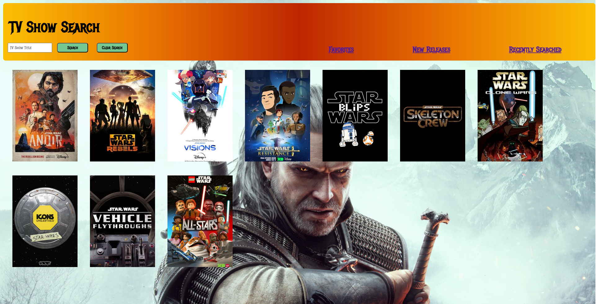

# TV-Show-Search

## Documentation

This application was built using the TVMaze API.  Documentation can be found by visiting the site at: https://tvmaze.com/api.  The search is performed using the query string listed below.

URL: /search/shows?q=:query

Example: https://api.tvmaze.com/search/shows?q=dragons

